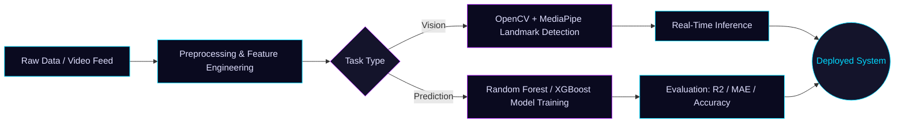

<div align="center">


<a href="https://github.com/MOKSH0077">
  
</a>

<br/><br/>

<a href="mailto:mokshgargacharya8@gmail.com"></a>
<a href="https://github.com/MOKSH0077"></a>

</div>

<br/>

## `$` core.identity

```yaml
name:      Moksh Sharma
education: B.Tech CSE — DCRUST Murthal (2024–2028)
role:      AI/ML Lead @ GDG On Campus DCRUST

mission: >
  Designing intelligent systems that perceive, learn,
  and act — from real-time vision pipelines to
  autonomous AI agents.
```

<br/>

## `01` — core skills

<div align="center">


</div>

<table width="100%">
<tr>
<th align="left" width="25%">DOMAIN</th>
<th align="left">APPLIED STACK</th>
</tr>
<tr>
<td>Agentic &amp; Generative AI</td>
<td>Claude · MCP · Cursor</td>
</tr>
<tr>
<td>Machine Learning</td>
<td>Regression · Classification · Clustering · Random Forest · XGBoost</td>
</tr>
<tr>
<td>Computer Vision</td>
<td>Real-time landmark detection · gesture recognition · frame pipelines</td>
</tr>
<tr>
<td>Data Science</td>
<td>Data preprocessing · feature engineering · model evaluation</td>
</tr>
</table>

<br/>

## `02` — languages

<div align="center">


</div>

<br/>

## `03` — frameworks & libraries

<div align="center">


<br/>


</div>

<br/>

## `04` — tools & platforms

<div align="center">


<br/>


</div>

<br/>

## `05` — deployed systems

<table width="100%">
<tr>
<td width="50%" valign="top">

**AI Virtual Mouse**
Real-time hand-gesture recognition system for cursor control via landmark detection and frame-processing optimization.
`OpenCV` `MediaPipe` `Python`

</td>
<td width="50%" valign="top">

**Workout Recommender System**
ML-based recommendation engine delivering personalized workout suggestions using XGBClassifier.
`Python` `Pandas` `XGBoost`

</td>
</tr>
<tr>
<td width="50%" valign="top">

**House Price Prediction System**
Random Forest regression + classification model with feature engineering, evaluated via R² and MAE.
`Scikit-learn` `Pandas` `Matplotlib`

</td>
<td width="50%" valign="top">

**Car Price Prediction Model**
Supervised learning pipeline — data cleaning, encoding, and model validation with Random Forest.
`Python` `Scikit-learn`

</td>
</tr>
</table>

<div align="center">
<a href="https://github.com/MOKSH0077?tab=repositories"></a>
</div>

<br/>

## `06` — how I build



<br/>

## `07` — achievements

<table width="100%">
<tr><td width="8%">🥈</td><td width="30%"><b>1st Runner-Up</b></td><td>Delhi University</td></tr>
<tr><td>🥈</td><td><b>1st Runner-Up</b></td><td>Evolotek Solutions Pvt. Ltd. — Atal Bihari Vajpayee Scientific Convention Center, Lucknow, UP</td></tr>
<tr><td>🎖</td><td><b>3× Hackathon Finalist</b></td><td>Multiple national-level hackathons</td></tr>
<tr><td>👥</td><td><b>AI/ML Lead</b></td><td>GDG On Campus DCRUST (2025–2026)</td></tr>
</table>

<br/>

## `08` — system metrics

<div align="center">


</div>

<br/>

<div align="center">

```
> perceive. learn. act. — building AI systems end to end.
```


</div>
