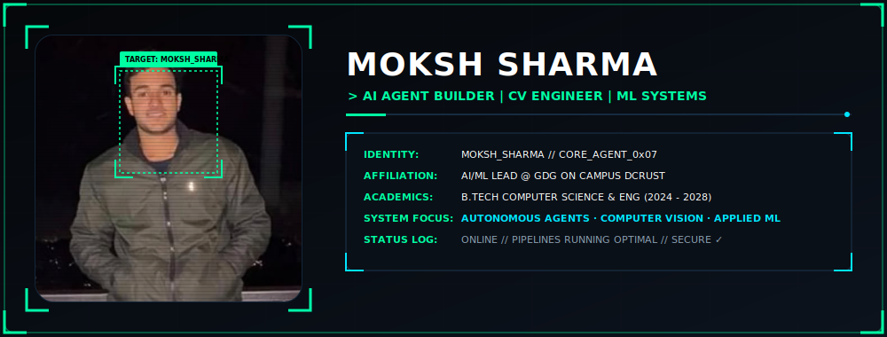

<h1 align="center" style="display:none;">Moksh Sharma - AI Agent Builder, Computer Vision Engineer &amp; Machine Learning Lead</h1>

<div align="center">

<!-- Custom SVG Profile Banner with Bounding Boxes & Tech HUD -->


<br/><br/>

<!-- High-Tech Typing SVG -->
<a href="https://github.com/MOKSH0077">
  
</a>

</div>

<br/>

## 👨‍💻 whoami

<table width="100%">
<tr>
<td width="100%" valign="middle">

```yaml
> identity.cfg

name:       Moksh Sharma
role:       AI/ML Lead @ GDG On Campus DCRUST
education:  B.Tech CSE — DCRUST Murthal (CGPA: 7.97/10 Till 3rd Sem)
focus:      Agentic AI · Computer Vision · Machine Learning

mission: >
  To design and deploy advanced artificial intelligence systems that perceive,
  reason, and act—from custom Model Context Protocol (MCP) servers and RAG pipelines
  to real-time hand-gesture vision control systems.
```

</td>
</tr>
</table>

<br/>

## 🛠️ tech_stack.sh

<table width="100%">
<tr>
<td width="50%" valign="top">

#### `// AGENTIC_AI_STACK`


</td>
<td width="50%" valign="top">

#### `// GENERATIVE_AI_STACK`


</td>
</tr>
<tr>
<td width="50%" valign="top">

#### `// COMPUTER_VISION_STACK`


</td>
<td width="50%" valign="top">

#### `// MODEL_CONTEXT_PROTOCOL`


</td>
</tr>
<tr>
<td width="50%" valign="top">

#### `// MACHINE_LEARNING_STACK`


</td>
<td width="50%" valign="top">

#### `// DATA_SCIENCE_STACK`


</td>
</tr>
</table>

<br/>

<div align="center">

**LANGUAGES &amp; ENGINES**


<br/>

**CORE UTILITIES &amp; ENVIRONMENTS**


</div>

<br/>

## 🚀 featured_builds

<table width="100%">
<tr>
<td width="50%" valign="top">

### `[ SYSTEM_01 ]` AI Virtual Mouse
> **Interface**: Hand-landmark tracking & gesture processing.
* Real-time computer vision system translating physical hand movements to cursor coordinates.
* Implemented optimized frame processing and bounding box coordinates for gesture classification.
* **Core Stack**: `OpenCV` · `MediaPipe` · `Python`

</td>
<td width="50%" valign="top">

### `[ SYSTEM_02 ]` Workout Recommender
> **Interface**: ML Classification Engine.
* Core recommendation logic to generate personalized routines based on profile variables.
* Developed custom features and evaluated classification rules using XGBoost metrics.
* **Core Stack**: `Python` · `Pandas` · `XGBClassifier`

</td>
</tr>
<tr>
<td width="50%" valign="top">

### `[ SYSTEM_03 ]` House Price Predictor
> **Interface**: Supervised Forest Pipeline.
* Combined regression and classification architectures for real-estate market valuation.
* Performed feature extraction, engineering, and validated performance through R² and MAE scoring.
* **Core Stack**: `Scikit-Learn` · `Pandas` · `Matplotlib`

</td>
<td width="50%" valign="top">

### `[ SYSTEM_04 ]` Car Price Prediction
> **Interface**: Supervised Regression Pipeline.
* Built validation matrices, data cleaning logic, and encoding layers to process high-cardinality items.
* Evaluated validation trends and forest depth configurations to prevent overfitting.
* **Core Stack**: `Python` · `Scikit-Learn`

</td>
</tr>
<tr>
<td width="50%" valign="top">

### `[ SYSTEM_05 ]` SafeLife AI
> **Interface**: Reinforcement Learning Safety Agent.
* Core training pipeline using Gymnasium and policy-gradient reinforcement learning methods.
* Optimizes navigation and goal achievement while minimizing negative environmental side-effects.
* **Core Stack**: `Python` · `PyTorch` · `Gymnasium` · `RL_Algorithms`

</td>
<td width="50%" valign="top">

### `[ SYSTEM_06 ]` Additional Builds
> **Interface**: Logic-Based System Runtimes.
* Light Python applications designed for testing general software engineering concepts.
* Includes custom command-line utilities, authentication helpers, and logic game state engines.
* **Core Stack**: `Python` · `Tkinter` · `Standard_Libraries`

</td>
</tr>
</table>

<div align="center">

<br/>

<a href="https://github.com/MOKSH0077?tab=repositories">
  
</a>

</div>

<br/>

## 🏆 achievements

<table width="100%">
<tr>
<td width="25%" align="center" valign="top">

`[ LEAD_DELEGATE ]`
#### AI/ML Lead
**GDG On Campus DCRUST**
*Led AI/ML technical workshops, training bootcamps, and developer initiatives.*

</td>
<td width="25%" align="center" valign="top">

`[ SYSTEM_WON_01 ]`
#### 1st Place Winner
**Technophilia (Delhi Univ)**
*Outperformed regional teams to secure 1st place in the flagship university hackathon.*

</td>
<td width="25%" align="center" valign="top">

`[ SYSTEM_WON_02 ]`
#### 1st Runner-Up
**Evolotek Solutions Hackathon**
*Awarded 2nd place at Scientific Convention Center, Lucknow for high-impact ML solutions.*

</td>
<td width="25%" align="center" valign="top">

`[ SYSTEM_METRIC ]`
#### Hackathon Finalist
**3x National Finalist**
*Placed in top tiers across major national hackathons. Organizing Team for Hack-Rust 1.0.*

</td>
</tr>
</table>

<br/>

## 📊 system_metrics

<div align="center">


<br/>


</div>

<br/>

## 📬 connect

<div align="center">

<a href="mailto:mokshgargacharya8@gmail.com"></a>
<a href="https://www.linkedin.com/in/moksh-sharma-0a5188337"></a>
<a href="https://x.com/Moksh__sharma77"></a>

<br/><br/>

```
> perceive. reason. act. — building cognitive systems.
```


</div>
